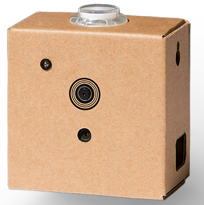
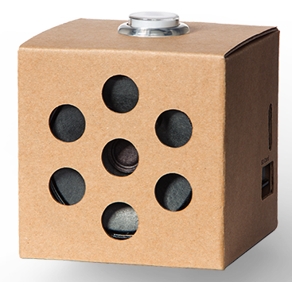

# ROS-waypoint-navigation
This is the code to drive the robot through a series of waypoint defined by the user. The package includes navigation by GamesOnTrack, odometry and fiducial markers.

## Setup
Install pyproj package
```
sudo apt-get install python-pip
sudo pip install pyproj
```

## Navigation
When a waypoint is set, the robot movement is devided into two phases: turining to the waypoint and forwarding to the waypoint. For each phases, the robot follows below equations.

**While turning**
```python
vel.linear.x = 0
vel.angular.x = K_ROLL * roll
vel.angular.y = K_PITCH * pitch
vel.angular.z = K_YAW * yaw
```

**While forwarding**
```python
vel.linear.x = K_RHO * distance
vel.angular.y = K_PITCH * pitch
vel.angular.z = K_YAW * yaw
```

## Delivery scenario
The demo is designed to ask the robot fetch the object and deliver it back to the user. Several technologies are involved in this demo such as voice/vision recognition, robot control, localisation, navigation and speech synthesis. The vision and voice recognition are done by the Google AIY Vision and Voice, respectively.

### [Google AIY Vision Kit](https://aiyprojects.withgoogle.com/vision)


### [Google AIY Voice Kit](https://aiyprojects.withgoogle.com/voice)


### Run the demo

From robot
```
roslaunch arlobot_bringup arlobot_laser.launch		# Run arlobot with RPLidar
roslaunch waypoint_nav delivery.launch			# Run delivery ROS action
```

From Vision Kit
```
./vision.py		# See code in AIY folder
```

From Voice Kit
```
./voice.py		# See code in AIY folder
```

## Launch files
**fiducial_encoder_waypoint.launch:** 3D waypoint navigation by fiducials together with encoders. The encoders are used to localise the robot while the fiducials are used to correct the transformation from odometry frame to utm frame.

**encoder_waypoint.launch:** 3D waypoint navigation by encoders only. Two waypoints are needed to intialise the robot. The first waypoint is to set the robot position in GPS frame while the second waypoint is to orientate the robot and define the destination at the same time.

**odometry_control.launch:** Higher level control based on odometry. Commands such as 'forward 1 meter' and 'turn 90 degrees'.

## 3d_waypoint_control.py

The package is able to navigate the robot in 3D.

### Publishers

**cmd_vel** ([geometry_msgs/Twist](http://docs.ros.org/api/geometry_msgs/html/msg/Twist.html))

Robot speed command

**waypoint/robot_state** ([std_msgs/String](http://docs.ros.org/api/std_msgs/html/msg/String.html))

Represents robot state

**calib_pose** ([nav_msgs/Odometry](http://docs.ros.org/api/nav_msgs/html/msg/Odometry.html))

Used to send the robot initial position to the localisation module.

### Subscribers

**robot_gps_pose** ([nav_msgs/Odometry](http://docs.ros.org/api/nav_msgs/html/msg/Odometry.html))

Robot GPS position

**waypoint** ([sensor_msgs/NavSatFix](http://docs.ros.org/api/sensor_msgs/html/msg/NavSatFix.html))

Waypoint GPS position

**waypoint/state** ([std_msgs/String](http://docs.ros.org/api/std_msgs/html/msg/String.html))

State to enable/disable waypoint navigation

**waypoint/control_parameters** ([std_msgs/String](http://docs.ros.org/api/std_msgs/html/msg/String.html))

Waypoint control parameters.

**waypoint/max_linear_speed** ([std_msgs/Float32](http://docs.ros.org/api/std_msgs/html/msg/Float32.html))

Robot max linear speed, defaule 1.0 m/s.

**waypoint/max_angular_speed** ([std_msgs/Float32](http://docs.ros.org/api/std_msgs/html/msg/Float32.html))

Robot max angular speed, defaule 1.0 rad/s.

**waypoint/turning_thres** ([std_msgs/Float32](http://docs.ros.org/api/std_msgs/html/msg/Float32.html))

Threshold for the turning phase.

## encoder_waypoint_localization.py

The package is able to localise the robot by encoders.

### Publishers

**robot_gps_pose** ([nav_msgs/Odometry](http://docs.ros.org/api/nav_msgs/html/msg/Odometry.html))

Robot GPS position

### Subscribers

**calib_pose** ([nav_msgs/Odometry](http://docs.ros.org/api/nav_msgs/html/msg/Odometry.html))

Used to calib the transformation from odometry frame to utm frame.

**odom** ([nav_msgs/Odometry](http://docs.ros.org/api/nav_msgs/html/msg/Odometry.html))

Robot odometry

## fiducial_waypoint_localization.py

The package is able to localise the robot by fiducials.

### Publishers

**robot_gps_pose** ([nav_msgs/Odometry](http://docs.ros.org/api/nav_msgs/html/msg/Odometry.html))

Robot GPS position, when used to calib encoders, the topic should be mapped to "/calib_pose"

### Subscribers

**fiducial_map_GPS** ([fiducial_msgs/FiducialMapEntryArray](http://http://docs.ros.org/kinetic/api/fiducial_msgs/html/msg/FiducialMapEntryArray.html))

Update the fiducial map, the fiducial position should be in GPS frame.

**fiducial_transforms** ([nav_msgs/Odometry](http://http://docs.ros.org/kinetic/api/fiducial_msgs/html/msg/FiducialTransformArray.html))

Array of transformations from the fidicials markers to the camera.

## odometry_control.py
Higher level control based on odometry.

### Publishers

**cmd_vel** ([geometry_msgs/Twist](http://docs.ros.org/api/geometry_msgs/html/msg/Twist.html))

Robot speed command

### Subscribers

**odom** ([nav_msgs/Odometry](http://docs.ros.org/api/nav_msgs/html/msg/Odometry.html))

Robot odometry.

**odometry_control/cmd** ([std_msgs/String](http://docs.ros.org/api/std_msgs/html/msg/String.html))

Higher level command.

**odometry_control/state** ([std_msgs/String](http://docs.ros.org/api/std_msgs/html/msg/String.html))

State to enable/disable odometry control

**odometry_control/control_parameters** ([std_msgs/String](http://docs.ros.org/api/std_msgs/html/msg/String.html))

Odometry control parameters.

**odometry_control/max_linear_speed** ([std_msgs/Float32](http://docs.ros.org/api/std_msgs/html/msg/Float32.html))

Robot max linear speed, defaule 1.0 m/s.

**odometry_control/max_angular_speed** ([std_msgs/Float32](http://docs.ros.org/api/std_msgs/html/msg/Float32.html))

Robot max angular speed, defaule 1.0 rad/s.

**odometry_control/forwarding_thres** ([std_msgs/Float32](http://docs.ros.org/api/std_msgs/html/msg/Float32.html))

Threshold for the forward phase.

**odometry_control/turning_thres** ([std_msgs/Float32](http://docs.ros.org/api/std_msgs/html/msg/Float32.html))

Threshold for the turning phase.

## R3_functions.py
General functions that are used by other codes.
